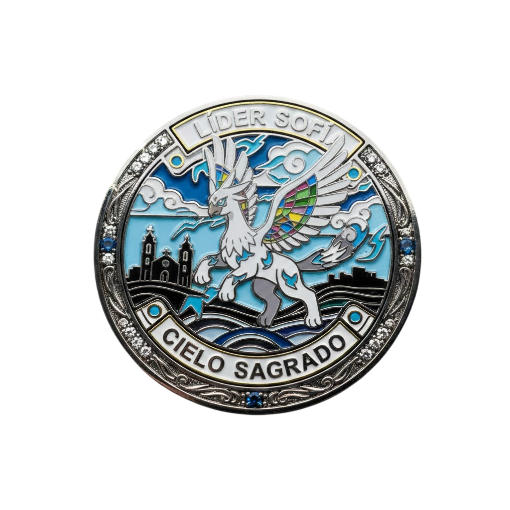

<!-- #cSpell:disable -->

**#Líder Sofía – La Guardiana del Viento de Cali**

<!-- IMG -->

**## HISTORIA COMPLETA**
Sofía creció visitando la icónica Ermita de Cali con su familia, fascinada por su arquitectura gótica y por las aves que siempre volaban en círculos sobre sus torres blancas. Desde niña sentía que el viento le hablaba, que las alturas eran hogar y que mirar la ciudad desde arriba le daba claridad que nadie más tenía.

Un día de tormenta, mientras protegía a unas palomas refugiadas cerca de los campanarios, un vendaval inesperado hizo que una criatura majestuosa bajara de las nubes: un enorme Piokémon blanco alado, con plumas que brillaban con la luz de los relámpagos. Había sido arrastrado por la tempestad y chocó contra la estructura. Sofía, sin dudarlo, lo ayudó a resguardarse y a sanar sus alas. Desde entonces, ese Piokémon decidió permanecer a su lado, convirtiéndose en su compañero y símbolo: Cielavión, el soberano del cielo caleño.

Sofía encontró en la Ermita el lugar perfecto para crear un gimnasio que enseñara a ver más allá de lo evidente. Su misión es inspirar a los entrenadores a confiar en sí mismos, a mantener la calma incluso en mitad de la tormenta, y a encontrar fuerza en la libertad.

**Tipo de Gimnasio:**
Volador (temática: viento, alturas, espiritualidad urbana)

**Ubicación:**
La Ermita – Santiago de Cali

**Compañero Piokemon principal:**
Cielavión – Tipo Volador/Eléctrico

**Habilidad especial:** Corrientes Sagradas

Genera ráfagas electrificadas que alteran la velocidad del rival y protegen a sus aliados con campos de viento estático.

**MISIÓN ANTES DEL COMBATE**
Para enfrentar a Sofía deberás superar tres desafíos que pondrán a prueba tu control del viento y tu precisión:

**✔ ”Auxilio Ascendente”**
Un Piokemon  ave herido necesita llegar a la parte alta de la Ermita.
Activa ventiladores y corrientes de aire para elevarlo por el camino correcto, evitando cables eléctricos y turbulencias que puedan desviarlo.

**Texto del NPC técnico:**
“El viento es libre, pero solo un espíritu decidido sabe guiarlo.
Si logras ordenar estos símbolos, las alturas te abrirán su camino.”

**RECOMPENSA**

**Medalla:**⚡ Medalla Cielo Sagrado

<!-- Medalla sin fondo no disponible -->

**MT:**Chispa Aérea (ataque especial Eléctrico con 30% de paralizar)

**Beneficios:**
✔ Piokemon de hasta nivel 40 te obedecen
✔ Desbloquea acceso al “Campanario Superior”, área especial del mapa

**##DIÁLOGOS OFICIALES**

**Antes de la batalla:**
“El cielo no pertenece a quien lo mira, sino a quien se atreve a volar. Has seguido las corrientes del viento, has ayudado a quien lo necesitaba y no temiste a la altura ni a la tormenta.
Muéstrame si tus alas están listas.”

**Durante la batalla (cuando usa su último Piokémon):**
“El viento se vuelve más fuerte… No caeremos desde estas alturas.
¡Cielavión, vuela más alto y descarga toda tu convicción!”

**AL perder (si el jugador lo derrota):**
“Has enfrentado la tormenta y aún sigues en pie…
Eso solo lo logran quienes realmente escuchan al cielo.
Acepta la Medalla Cielo Sagrado.
**Que nunca olvides:** la verdadera fuerza es aquella que levanta a los demás.”