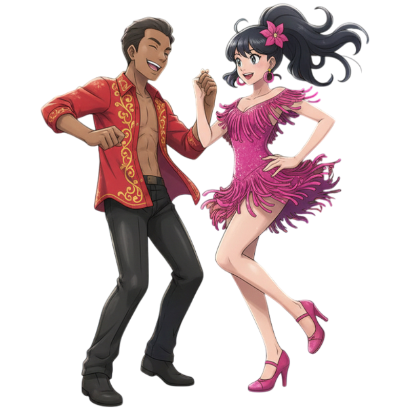

<!-- #cSpell:disable -->

**#Presentación de Personajes:** ¡Bailarines de Salsa!

<!-- IMG -->

**Nombre de los Entrenadores: **
Juan y Sofía 

**Clase de Entrenador:** Bailarines de Salsa Estilo:
Alegre, enérgico y lleno de ritmo. 

**Frase al iniciar el combate:** "¡Prepárense para sentir el sabor de la victoria! ¡A bailar, Pokémon!" 

**Frase al ser derrotados:**
"Nos han sacado de la pista, ¡pero la rumba sigue!"

**Piokemon Representativos:**

**Juan - Ludicolo (Piokemon de Juan):**
Con su estilo de baile único y su tipo Agua/Planta, Ludicolo encaja perfectamente con el ritmo y la alegría de Juan. Su habilidad "Nado Rápido" refleja la agilidad en la pista.

**Sofía - Ribombee (Piokemon de Sofía):**
La gracia y velocidad de Ribombee, junto con su tipo Bicho/Hada, complementan la elegancia y la viveza de Sofía. Sus movimientos ágiles y sus "polen de esporas" podrían ser como chispas de confeti en la pista de baile.

**Piokemon Representativos:**

- **Juan - Ludicolo (Piokemon de Juan):** Con su estilo de baile único y su tipo Agua/Planta, Ludicolo encaja perfectamente con el ritmo y la alegría de Juan. Su habilidad "Nado Rápido" refleja la agilidad en la pista.

- **Sofía - Ribombee (Piokemon de Sofía):** La gracia y velocidad de Ribombee, junto con su tipo Bicho/Hada, complementan la elegancia y la viveza de Sofía. Sus movimientos ágiles y sus "polen de esporas" podrían ser como chispas de confeti en la pista de baile.

**#Medalla:**
<!-- Medalla Salsa Go no disponible en la carpeta actual -->